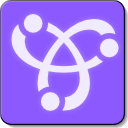

# MFRemotes



**A simple peer to peer connection framework build upon Bonjour and Network frameworks.**

## Usage

### 1 - Start a remotes session

There is only one remote session running.

Import MFRemotes and create a server object.

```
import Foundation
import MFRemotes

class MyController {

    lazy var remotesServer = {
        let info = MFRemotesServiceInfo(name: "MeshLab Remotes server",
                                        type: "_meshlab._tcp",
                                        version: "1.0")
        let remoteAPI = MeshLabRemotes()
        
        return MFRemotesServer(serviceInfo: info, api: remoteAPI)
    }()
...
```

### 2 - Start a remotes session

From this very moment, using a Network browser on a device around will detect this session.

```
import Foundation
import MFRemotes

class MeshLabRemotes: MFRemotesAPIProtocol {
    func prepareRemoteConfigurationData() -> Data? {
        
    }
    
    var dataHandler: ((Data) -> Void) = { data in
        print(data)
    }
}
```

### 3 - Connect a remote

In the remote app code


## Classes

RemotesSessionManager.swift

RemotesAPI.swift

RemoteConnector.swift

RemoteInterface.swift

NetworkBrowser.swift

MFRemotes.swift

MFRemotesServer.swift

BonjourServer.swift

--

*©2024 Moose Factory Software*
